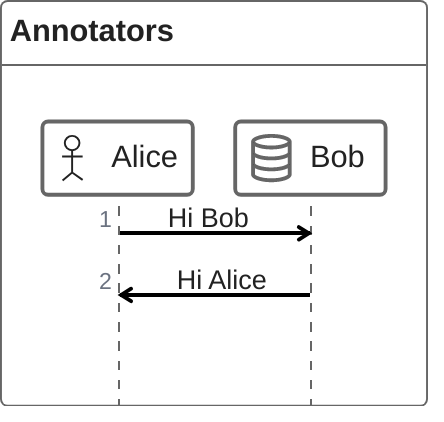

# test-diagrams

Here is a simple flow chart:

```mermaid
architecture-beta
    group api(logos:aws-lambda)[API]

    service db(logos:aws-aurora)[Database] in api
    service disk1(logos:aws-glacier)[Storage] in api
    service disk2(logos:aws-s3)[Storage] in api
    service server(logos:aws-ec2)[Server] in api

    db:L -- R:server
    disk1:T -- B:server
    disk2:T -- B:db
```





```html
<html>
  <body>
    <pre class="mermaid">
        architecture-beta
            group api(logos:aws-lambda)[API]

            service db(logos:aws-aurora)[Database] in api
            service disk1(logos:aws-glacier)[Storage] in api
            service disk2(logos:aws-s3)[Storage] in api
            service server(logos:aws-ec2)[Server] in api

            db:L -- R:server
            disk1:T -- B:server
            disk2:T -- B:db

    </pre>


    <script type="module">
      import mermaid from 'https://cdn.jsdelivr.net/npm/mermaid@11/dist/mermaid.esm.min.mjs';
      mermaid.initialize({ startOnLoad: true });
      
      // copy-pasta from the documentation
      mermaid.registerIconPacks([
        {
          name: 'logos',
          loader: () =>
            fetch('https://unpkg.com/@iconify-json/logos@1/icons.json').then((res) => res.json()),
        },
      ]);

    </script>
  </body>
</html>
```
